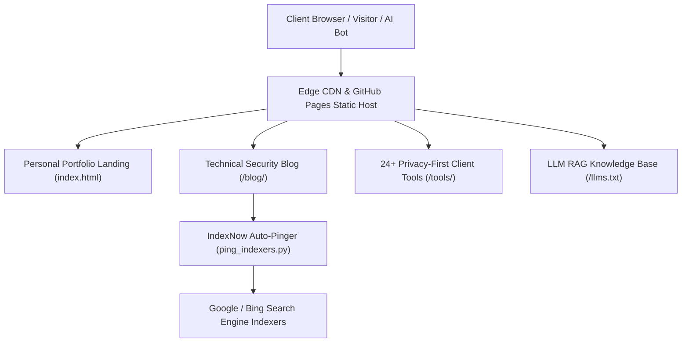

# Zyekh.com (`zyekh.com`)

<p align="center">
  <a href="https://zyekh.com">
    
  </a>
  <a href="LICENSE">
    
  </a>
  <a href="https://zyekh.com/manifest.json">
    
  </a>
  <a href="https://zyekh.com/security.txt">
    
  </a>
  <a href="https://zyekh.com/sitemap.xml">
    
  </a>
</p>

> **Official website, portfolio, technical blog, and client-side web utility tools for Zyekh Abdul Qadir Jailani (Full Stack Developer & Security Researcher).**

Hosted directly on **GitHub Pages** with custom domain [`zyekh.com`](https://zyekh.com).

---

## 🏗️ Web Portal Architecture & Data Flow



---

## 📁 Repository Structure

```
zyekh.com/
├── index.html              # Main Portfolio & Homepage
├── blog/                   # Technical Articles & Hardening Guides
│   ├── index.html          # Blog Directory Page
│   └── linux-vps-hardening-guide-2026.html
├── tools/                  # Client-side Privacy Web Utilities
│   ├── index.html          # Tools Directory Page
│   ├── zakat.html          # Zakat Calculator
│   ├── pph21.html          # PPh 21 Tax Calculator
│   ├── thr.html            # THR Calculator
│   ├── kpr.html            # Mortgage / KPR Simulator
│   ├── split-bill.html     # Bill Splitter
│   ├── password.html       # Secure Password Generator
│   ├── qr.html             # QR Code Generator
│   ├── diff-checker.html   # Side-by-Side Diff Checker
│   ├── pomodoro.html       # Pomodoro Focus Timer
│   └── ...                 # Additional utility tools
├── assets/                 # Static Assets
│   ├── icons/              # Favicons, Apple Touch Icons, PWA Icons
│   └── img/                # Profile & Page Images
├── CNAME                   # GitHub Pages Custom Domain Configuration
├── manifest.json           # Web App Manifest
├── browserconfig.xml       # Windows Tile Settings
├── sitemap.xml             # XML Sitemap for Search Engines
└── robots.txt              # Search Engine Crawler Directives
```

---

## 🛠️ Stack & Technologies

- **Markup & Layout**: Semantic HTML5, [PureCSS](https://purecss.io/) Grid System
- **Styling & Design**: Vanilla CSS Custom Properties (Dark Mode Theme)
- **Scripting**: Pure JavaScript (No Framework Overheads / Client-side execution)
- **Deployment**: Static Site Hosting via GitHub Pages
