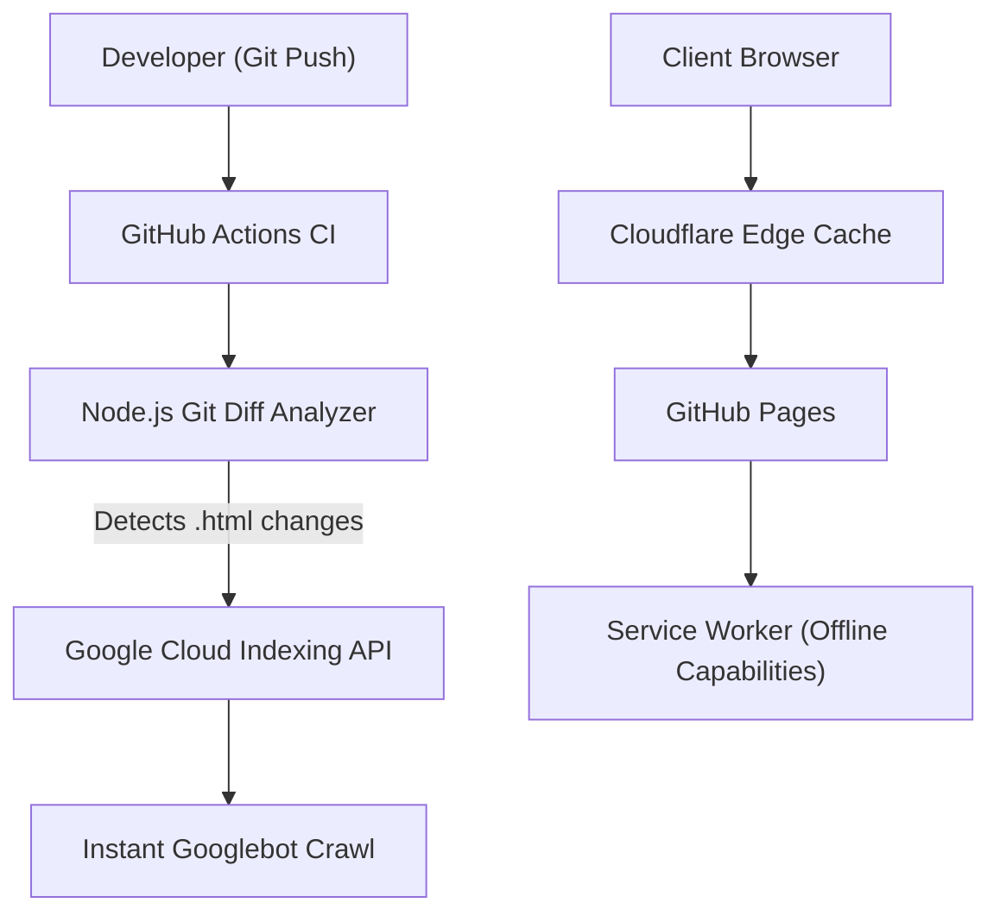

<h1 align="center">
  Zyekh's Zero-Dependency Web Hub
</h1>

  <strong>42 Local-First, Zero-Dependency Developer & Financial Tools. Built entirely with Vanilla JS/CSS.</strong>

  
  
  
  

---

## [ PHILOSOPHY ] The Philosophy

Modern web development has become bloated. A simple password generator now requires a 200MB Node module folder, a bundler, and connects to 3 different telemetry servers. 

This repository is a counter-movement:
- **Zero Frameworks:** No React, No Vue, No Tailwind. Pure semantic HTML5 and Vanilla CSS variables.
- **Zero Dependencies:** No NPM, no third-party libraries. Everything is written from scratch.
- **Zero Tracking:** No Google Analytics, no telemetry. 
- **100% Local Execution:** Every tool runs purely in your browser. Disconnect from the internet, and they still work via Service Worker caching (PWA).

## [ TOOLS ] The 42 Tools (`/tools/`)

You can view the full suite at [zyekh.com/tools](https://zyekh.com/tools).

**Security & Developer Utilities (Examples):**
- **JSON Validator/Formatter:** Parses locally via AST, no data sent to external servers.
- **Diff Checker:** Strict local character-by-character string comparison.
- **Chmod Calculator:** 4-digit octal notation calculator (SUID, SGID, Sticky).
- **JWT Decoder:** Decodes payload securely in-browser without sending tokens anywhere.
- **Password Generator:** Uses `crypto.getRandomValues()` for cryptographically secure entropy.

**Financial Calculators:**
- Mortgage (KPR), PPh 21 Tax, Zakat, Auto Loan, Salary calculators—all executing math locally.

## [ AI-OPTIMIZED ] AI-Optimized Knowledge Base (`/blog/`)

This site isn't just optimized for human readers and Googlebot; it's optimized for LLMs. 
We strictly implement `.well-known/llms.txt` and `llms-full.txt` routing, allowing Perplexity, ChatGPT, and Claude to instantly ingest the entire repository's knowledge base via Markdown.

## [ ARCHITECTURE ] Technical Architecture & CI/CD

The repository features a state-of-the-art SEO pipeline. Pushing changes to `main` triggers a GitHub Action that calculates the diff, identifies modified `.html` files, and pings the **Google Indexing API** via a secure Service Account to force a crawl within minutes.

## [ LICENSE ] License

[MIT License](LICENSE) - Feel free to fork, dissect, and steal the code. That's the point of open source.
